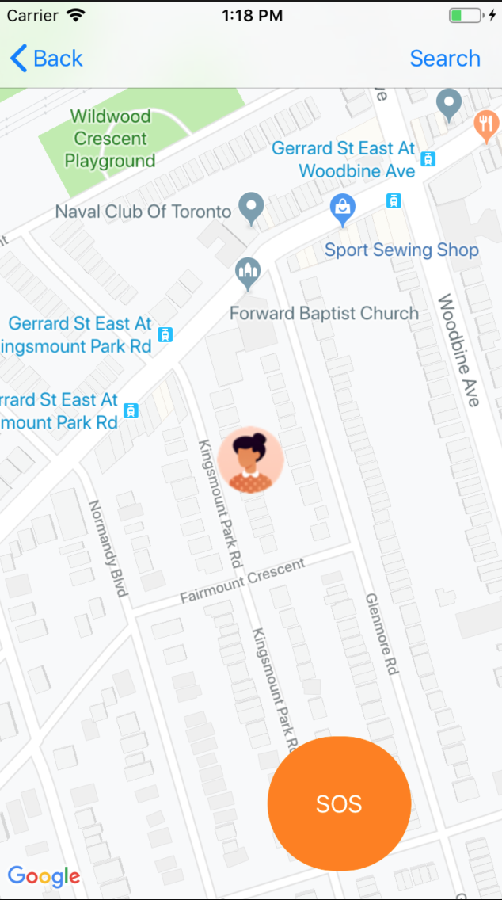

# KeepSafe
***Currently still in development***

A safety based app that allows users to share their live locations with people in their circle. The purpose of this app is to provide a sense of security for vulnerable people in threatening situations. Users who work or live in rough parts of the neighborhood are allowed to have peace of mind knowing that they have close friends or family member knowing that they are safe.

This project still needs work on UI and UX, the readme will continue to be updated as significant changes are made to the project.

**Different options available**

**Add friends and search thorough your circle**

**Find chats with people in your circle where you can share images, videos and live location**

**Filter through different types of crime depending on borough and the the specific neighborhood**

**In this case, it shows robberies in the Upper Beaches area of Toronto. Annotations also show the date of the crime**
<<<<<<< HEAD

=======

>>>>>>> be7e75845f3cf7e395c9b3d9f1bd9d91360de9f2

